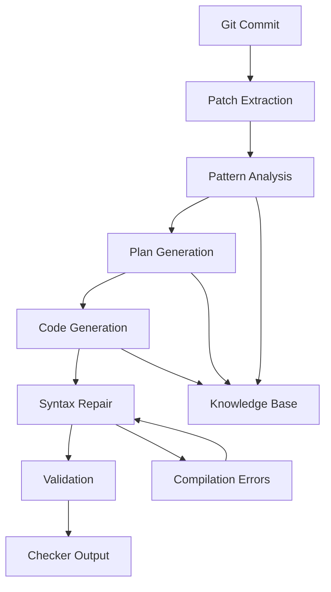
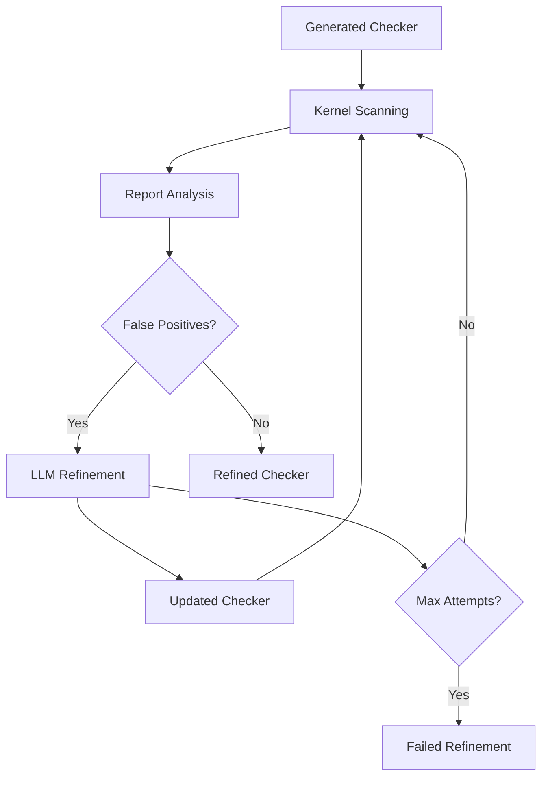

# KNighter Architecture & Component Guide


## Table of Contents
- [Project Overview](#project-overview)
- [Directory Structure](#directory-structure)
- [Core Components](#core-components)
- [Pipeline Workflows](#pipeline-workflows)
- [Data Flow](#data-flow)
- [Extending KNighter](#extending-knighter)

## Project Overview

KNighter is an LLM-powered static analysis checker synthesis tool that automatically generates Clang Static Analyzer (CSA) checkers from historical patch commits. The system transforms bug fix patches from the Linux kernel into functional static analysis checkers through a multi-stage AI-driven pipeline.

### Key Capabilities
- 🔍 **Patch Analysis**: Extracts bug patterns from Git commits
- 🤖 **LLM-Powered Generation**: Uses multiple AI models for checker synthesis
- 🔧 **Automatic Refinement**: Self-improves checkers by reducing false positives
- 📊 **Batch Processing**: Handles multiple commits and checkers efficiently
- 🚀 **Production Ready**: Integrates with LLVM and Linux kernel builds

## Directory Structure

```
knighter-dev/
├── 📁 src/                          # Core application code
│   ├── 🐍 main.py                   # Entry point & CLI interface
│   ├── 🤖 agent.py                  # LLM orchestration & prompting
│   ├── ⚙️ checker_gen.py            # Checker generation pipeline
│   ├── 🔄 checker_refine.py         # Checker refinement & improvement
│   ├── 🔍 checker_scan.py           # Static analysis execution
│   ├── 📊 checker_data.py           # Data models & persistence
│   ├── 🎯 model.py                  # Multi-LLM client management
│   ├── 🌐 global_config.py          # Configuration management
│   ├── 🛠️ tools.py                  # Utility functions
│   ├── 🏷️ commit_label.py           # Commit classification
│   ├── 📁 backends/                 # Analysis backend abstraction
│   │   └── 🔧 csa.py               # Clang Static Analyzer backend
│   ├── 📁 targets/                  # Target system abstraction
│   │   └── 🐧 linux.py             # Linux kernel integration
│   ├── 📁 tests/                    # Test suite
│   └── 📁 kparser/                  # Code parsing utilities
│       ├── 🌳 kparser.py           # Tree-sitter integration
│       ├── ⚡ kfunction.py         # Function analysis
│       └── 📁 tree-sitter-cpp/     # C++ parser (submodule)
├── 📁 checker_database/             # Pre-existing checker examples
│   ├── 📁 ArrayBoundChecker/        # Example: Array bounds checking
│   │   ├── 📄 checker.cpp          # Checker implementation
│   │   ├── 📝 pattern.md           # Bug pattern description
│   │   ├── 📋 plan.md              # Implementation plan
│   │   ├── 🧠 pattern_embedding.pt # Vector embedding
│   │   └── 🧠 plan_embedding.pt    # Vector embedding
│   └── ... (100+ more checkers)
├── 📁 prompt_template/              # LLM prompt engineering
│   ├── 📄 patch2pattern.md         # Patch → Pattern prompts
│   ├── 📄 pattern2plan.md          # Pattern → Plan prompts
│   ├── 📄 plan2checker.md          # Plan → Code prompts
│   ├── 📁 knowledge/               # Domain knowledge base
│   │   ├── 💡 utility.md          # Helper functions
│   │   ├── 💡 suggestions.md      # Best practices
│   │   └── 💡 template.md         # Code templates
│   └── 📁 examples/                # Few-shot learning examples
├── 📁 scripts/                     # Automation & setup scripts
│   ├── 🔧 setup_llvm.py           # LLVM environment setup
│   ├── 📊 collect_commits.py      # Commit harvesting
│   ├── ✅ collect_valid_checkers.py # Checker validation
│   ├── 📈 count_errors.py         # Error analysis
│   └── 🔢 count_tokens.py         # Token usage tracking
├── 📁 llvm_utils/                  # LLVM integration utilities
│   ├── 🏗️ create_plugin.py        # Plugin creation
│   ├── 🛠️ utility.cpp             # C++ utility functions
│   └── 🛠️ utility.h               # C++ utility headers
├── 📁 commits/                     # Commit data files
│   ├── 📄 commits.txt             # Evaluation commits
│   └── 📄 commits-sampled.txt     # Sampled commits for ablation
├── 📁 assets/                      # Documentation assets
├── 📄 config-example.yaml         # Configuration template
├── 📄 requirements.txt            # Python dependencies
├── 🐳 Dockerfile                  # Container definition
├── 🐳 docker-compose.yml          # Container orchestration
└── 📚 README.md                   # Project documentation
```

## Core Components

### 1. Entry Point & CLI (`src/main.py`)

**Purpose**: Main application entry point with CLI interface

**Key Features**:
- 5 operational modes: `gen`, `refine`, `scan`, `triage`, `label`
- Fire-based CLI with automatic help generation
- Configuration initialization and validation
- Error handling and logging setup

**Usage**:
```python
# Generate checkers from commits
python main.py gen --commit_file=commits.txt --config_file=config-generate.yaml

# Refine existing checkers
# This will scan the kernel with the checkers and refine them
python main.py refine --checker_dir=results/ --config_file=config-refine.yaml

# Triage the report
python main.py triage --config_file=config-refine.yaml results-refine/

# Scan kernel with a single checker only
python main.py scan_single --config_file=config-scan.yaml checker_file.cpp
```

### 2. LLM Agent Orchestrator (`src/agent.py`)

**Purpose**: Coordinates LLM interactions for the generation pipeline

**Key Functions**:
- `patch2pattern()`: Extracts bug patterns from patches
- `pattern2plan()`: Creates implementation plans
- `plan2checker()`: Generates checker code
- `repair_checker()`: Fixes compilation errors
- Template loading and prompt engineering

**Data Flow**:
```
Patch → pattern2pattern() → Bug Pattern
Bug Pattern → pattern2plan() → Implementation Plan
Implementation Plan → plan2checker() → Checker Code
```

### 3. Checker Generation Pipeline (`src/checker_gen.py`)

**Purpose**: End-to-end checker synthesis from commits

**Pipeline Stages**:
1. **Pattern Extraction**: Analyze patch to identify vulnerability pattern
2. **Plan Generation**: Create detailed implementation strategy
3. **Code Generation**: Produce compilable CSA checker
4. **Syntax Repair**: Fix compilation errors iteratively
5. **Validation**: Test against known examples

**Key Classes**:
- `CheckerGenerator`: Main pipeline orchestrator
- `GenerationConfig`: Pipeline configuration
- `GenerationResult`: Output metadata and statistics

### 4. Checker Refinement System (`src/checker_refine.py`)

**Purpose**: Improves generated checkers by reducing false positives

**Refinement Process**:
1. **Scanning**: Execute checker against Linux kernel
2. **Report Analysis**: Identify false positive patterns
3. **Refinement**: Generate improved checker versions
4. **Validation**: Re-test refined checkers
5. **Iteration**: Repeat until acceptable accuracy

**Key Functions**:
- `refine_checker()`: Main refinement workflow
- `analyze_reports()`: FP pattern identification

### 5. Static Analysis Backend (`src/backends/csa.py`)

**Purpose**: Clang Static Analyzer integration and abstraction

**Key Capabilities**:
- Checker compilation with LLVM build system
- Static analysis execution on Linux kernel
- Report generation and parsing
- Build system integration
- Error capture and diagnostics

**Key Methods**:
- `build_checker()`: Build checker plugin
- `run_checker()`: Execute static analysis
- `validate_checker()`: Validate checker
- `extract_reports()`: Extract bug reports

### 6. Multi-LLM Client (`src/model.py`)

**Purpose**: Unified interface for multiple LLM providers

**Supported Models**:
- **OpenAI**: GPT-4o, o1-preview, o3-mini
- **Anthropic**: Claude-3.5-Sonnet
- **Google**: Gemini-1.5-Pro
- **DeepSeek**: DeepSeek-V3, DeepSeek-Reasoner
- **Nvidia**: Various models via API

### 7. Data Models (`src/checker_data.py`)

**Purpose**: Core data structures and persistence

**Key Classes**:
- `CheckerData`: Checker metadata and state
- `RefineAttempt`: Refinement iteration tracking
- `ReportData`: Bug report analysis results
- `CheckerStatus`: State machine for checker lifecycle

**Persistence**:
- YAML serialization for human-readable configs
- JSON for structured data exchange
- File-based storage with atomic writes

### 8. Configuration Management (`src/global_config.py`)

**Purpose**: Centralized configuration and environment setup

**Configuration Sections**:
- **Paths**: LLVM, Linux kernel, output directories
- **Models**: LLM provider settings and API keys
- **Pipeline**: Generation and refinement parameters
- **Analysis**: Scanning timeouts and resource limits

**Singleton Pattern**: Ensures consistent configuration across all components

### 9. Knowledge Base (`prompt_template/knowledge/`)

**Purpose**: Domain-specific knowledge for LLM prompting

**Components**:
- `utility.md`: Pre-implemented helper functions for CSA
- `suggestions.md`: Best practices for checker development
- `template.md`: Standard checker code structure
- Examples of successful checker implementations

### 10. Checker Database (`checker_database/`)

**Purpose**: Comprehensive library of existing static analysis checkers

**Structure**: Each checker includes:
- `checker.cpp`: Full implementation
- `pattern.md`: Bug pattern description
- `plan.md`: Implementation strategy
- `*_embedding.pt`: Vector embeddings for similarity matching

**Usage**: Provides examples for few-shot learning and similarity-based retrieval

## Pipeline Workflows

### Primary Generation Workflow



### Refinement Workflow



## Data Flow

### Input Data Sources
- **Git Commits**: Linux kernel vulnerability fixes
- **Configuration**: YAML files with pipeline settings
- **Knowledge Base**: Domain expertise in Markdown format
- **Checker Database**: 100+ example checkers with embeddings

### Processing Stages
1. **Preprocessing**: Patch extraction and normalization
2. **Pattern Analysis**: LLM-based vulnerability pattern identification
3. **Plan Generation**: Detailed implementation strategy creation
4. **Code Synthesis**: CSA checker code generation
5. **Validation**: Compilation testing and error repair
6. **Refinement**: False positive reduction through iterative improvement

### Output Artifacts
- **Generated Checkers**: Compilable C++ CSA checker implementations
- **Documentation**: Patterns, plans, and implementation notes
- **Reports**: Analysis results and bug findings
- **Metadata**: Generation statistics and quality metrics
- **Logs**: Detailed pipeline execution traces

## Extending KNighter

### Adding New LLM Providers

1. **Extend Model Client** (`src/model.py`):
```python
def create_new_provider_client(api_key: str):
    """Add new LLM provider integration"""
    return NewProviderClient(api_key=api_key)
```

2. **Update Configuration**:
```yaml
# Add to llm_keys.yaml
new_provider_key: "your-api-key"
```

### Adding New Analysis Backends

**Create Backend Class** (`src/backends/new_backend.py`):
```python
class NewAnalysisBackend(AnalysisBackend):
    def build_checker(self, checker_code: str) -> bool:
        """Implement checker compilation"""
        pass

    def validate_checker(self, checker_code: str, commit_id: str, patch: str, target: TargetFactory, skip_build_checker=False) -> Tuple[int, int]:
        """Validate checker"""
        pass

    def run_checker(self, checker_code: str, commit_id: str, target: TargetFactory, object_to_analyze=None, jobs=32, output_dir="tmp", skip_build_checker=False, skip_checkout=False, **kwargs) -> int:
        """Implement static analysis execution"""
        pass

    def extract_reports(self, report_dir: str, output_dir: str, sampled_num: int = 5, stop_num: int = 5, max_num: int = 100, seed: int = 0) -> Tuple[Optional[List[ReportData]], int]:
        """Extract reports"""
        pass
```

### Adding New Target Systems

1. **Create Target Class** (`src/targets/new_target.py`):
```python
class NewTarget(Target):
    def checkout_commit(self, commit_id: str, is_before: bool = False, **kwargs):
        """Prepare target for analysis"""
        pass

    def get_object_name(file_name: str) -> str:
        """Get object name from file name"""
        pass

    def get_patch(self, commit_id: str) -> str:
        """Get patch from commit"""
        pass

    def path_similarity(path1, path2):
        """Calculate path similarity"""
```

2. Update existing backends to support the new target system
