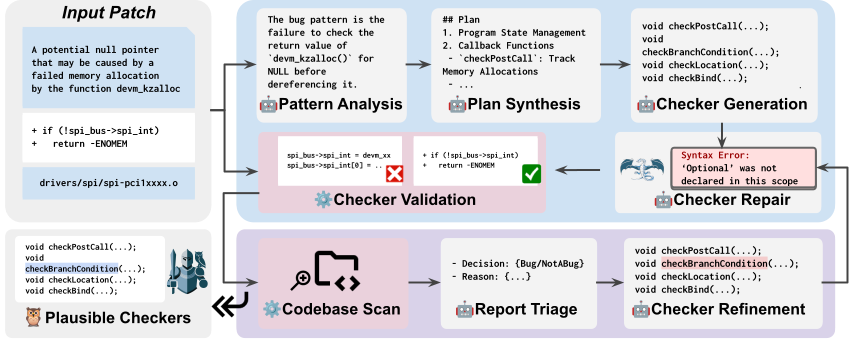

#  KNighter: Transforming Static Analysis with LLM-Synthesized Checkers

<p align="left">
    <a href="https://arxiv.org/abs/2503.09002">
</p>



## Table of Contents

- [About](#about)
- [Getting Started](#getting-started)
  - [Docker Setup (Recommended)](#docker-setup-recommended)
  - [Manual Environment Setup (Alternative)](#manual-environment-setup-alternative)
- [Running KNighter](#running-knighter)
- [Architecture Documentation](#architecture-documentation)

## About

**KNighter** is an innovative checker synthesis tool that leverages Large Language Models (LLMs) to automatically generate static analysis checkers from historical patch commits.

### Key Features

- **🤖 LLM-Powered Generation**: Automatically synthesizes static analysis checkers using state-of-the-art language models
- **📊 Multi-step Pipeline**: Employs a sophisticated generation → refinement → triage workflow for high-quality results
- **🔍 Historical Learning**: Learns from real-world patch commits to understand common bug patterns
- **⚡ LLVM Integration**: Built on top of LLVM for robust static analysis capabilities
- **🐧 Linux Kernel Focus**: Specialized for finding bugs in large-scale C/C++ codebases like the Linux kernel

> [!IMPORTANT]
> We are continuously improving the documentation and adding new features. Please stay tuned for updates.

## Getting Started

### Docker Setup (Recommended)

<details>
<summary><b>🐳 Docker Installation Options</b></summary>

#### Option 1: Docker Hub (Recommended)

```bash
docker pull knighterhub/knighter
```

#### Option 2: Build from Source

```bash
git clone https://github.com/ise-uiuc/KNighter.git KNighter
cd KNighter

docker build -t knighter .
```

</details>

<details>
<summary><b>🚀 Running the Container</b></summary>

```bash
# Pull from Docker Hub
docker run -it knighterhub/knighter

# Build from source
docker run -it knighter
```

</details>

<details>
<summary><b>⚙️ Environment Initialization</b></summary>

When running the container for the first time, initialize the environment:

```bash
cd /app
# This would take a while to download the dependencies and compile the LLVM
python3 scripts/init_docker.py
```

This downloads LLVM and Linux kernel source code into `/data/llvm` and `/data/linux`.

**API Key Configuration:**

```bash
echo 'openai_key: "YOUR_OPENAI_API_KEY"' > /app/llm_keys.yaml
```

</details>

### Manual Environment Setup (Alternative)

> **Note**: For detailed setup steps, refer to `scripts/init_docker.py` which contains the complete initialization process.

<details>
<summary><b>🔧 Manual Installation Steps</b></summary>

**Step 1: Install Dependencies**

Download and build [LLVM-18.1.8](https://github.com/llvm/llvm-project/releases/tag/llvmorg-18.1.8):

```sh
wget https://github.com/llvm/llvm-project/archive/refs/tags/llvmorg-18.1.8.zip
unzip llvmorg-18.1.8.zip
```

Git clone the Linux kernel source code:

```sh
git clone https://github.com/torvalds/linux.git
```

Install Python dependencies:

```sh
# Option 1: Using uv (recommended for faster installs)
curl -LsSf https://astral.sh/uv/install.sh | sh
source $HOME/.cargo/env
uv pip install -r requirements.txt

# Option 2: Using regular pip
pip3 install -r requirements.txt

git submodule update --init --recursive
```

**Step 2: Configuration Files**

Set up your `config.yaml` (see `scripts/init_docker.py` for reference):

```yaml
result_dir: "result-checkers"
LLVM_dir: "/PATH/TO/LLVM_DIR"
checker_nums: 10
linux_dir: "/PATH/TO/LINUX_DIR"
key_file: "llm_keys.yaml"
model: "o3-mini"
```

Set up the `llm_keys.yaml` file (see `llm_keys_example.yaml` for reference):

```yaml
openai_key: "sk-..."
claude_key: "sk-ant-..."
google_key: "AIza..."
deepseek_key: "sk-..."

# For local models (optional)
# In config, use "local:model_name" format to use local models
# Like "local:openai/gpt-oss-120b"
base_url: "http://localhost:8000/v1"
api_key: "dummy"
```

**Step 3: LLVM Setup**

```sh
python3 scripts/setup_llvm.py LLVM_PATH
```

</details>

## Running KNighter

### Quick Start (Docker)

For rapid evaluation, use the debug dataset:

```bash
cd /app/src

# Step 1: Generate checkers for debug commits
python3 main.py gen --config_file /app/config-generate.yaml --commit_file=/app/commits/commits-debug.txt

# Step 2: Refine generated checkers
python3 main.py refine --config_file /app/config-refine-debug.yaml /app/result-generate

# Step 3: Triage and analyze results
python3 main.py triage --config_file /app/config-triage-debug.yaml /app/result-refine-debug
```

<details>
<summary><b>📋 Pipeline Modes & Usage</b></summary>

**Available Operation Modes:**

| Mode | Purpose | Description |
|------|---------|-------------|
| `gen` | Generation | Generate new checkers from commit patches |
| `refine` | Refinement | Improve and validate generated checkers |
| `scan` | Scanning | Scan the kernel with validated checkers |
| `triage` | Analysis | Analyze and categorize scan results |

**Basic Usage (Manual Setup):**

```bash
cd src
python3 main.py <mode> --commit_file=<commits.txt> --config_file=<config.yaml>
```

**Example:**
```bash
python3 main.py gen --commit_file=../commits/commits-selected.txt --config_file=config.yaml
```

</details>

<details>
<summary><b>⚙️ Configuration Files</b></summary>

| File | Purpose | Key Parameters |
|------|---------|----------------|
| `config-generate.yaml` | Checker generation | `model`, `checker_nums`, `result_dir` |
| `config-refine.yaml` | Refinement process | `jobs`, `scan_timeout`, `scan_commit` |
| `config-triage.yaml` | Result analysis | Analysis parameters |

Modify these files to experiment with different parameters from the paper evaluation.

</details>

## Architecture Documentation

<details>
<summary><b>🏗️ System Architecture Overview</b></summary>

KNighter implements a multi-stage pipeline for automated checker synthesis:

1. **Commit Analysis**: Extract bug patterns from historical patches
2. **Checker Generation**: Use LLMs to synthesize static analysis checkers
3. **Refinement**: Validate and improve generated checkers through compilation and testing
4. **Deployment**: Apply refined checkers to target codebases
5. **Triage**: Analyze and categorize detected issues

For comprehensive architecture documentation, see [`ARCHITECTURE.md`](ARCHITECTURE.md).

</details>


---

**Citation**: If you use KNighter in your research, please cite our paper:
```bibtex
@article{knighter,
  title={KNighter: Transforming Static Analysis with LLM-Synthesized Checkers},
  author={Yang, Chenyuan and Zhao, Zijie and Xie, Zichen and Li, Haoyu and Zhang, Lingming},
  journal={arXiv preprint arXiv:2503.09002},
  year={2025}
}
```
